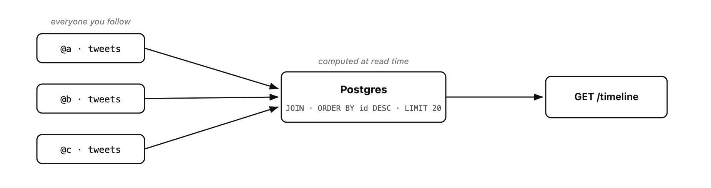
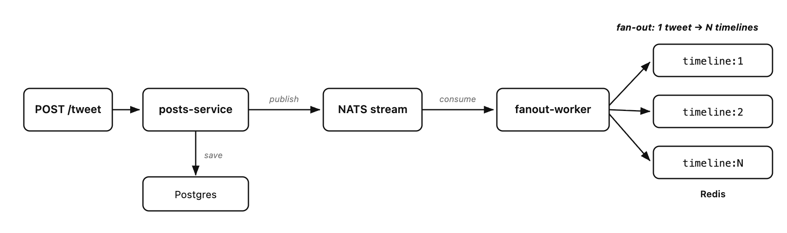
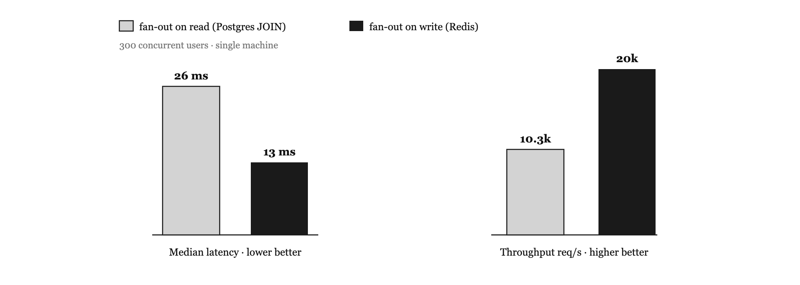
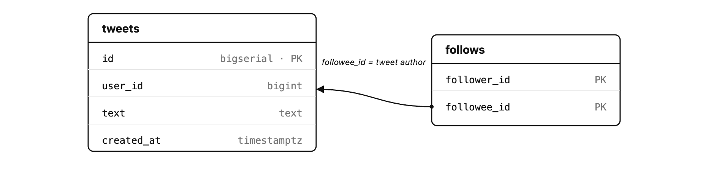

# mini-twitter

Two ways to build a Twitter home timeline, benchmarked.

Built to answer one question from *Designing Data-Intensive Applications* (ch. 1): when reads outnumber writes by ~65x — Twitter serves ~300k timeline reads/s but ingests only ~4.6k tweets/s — where should the expensive work happen: at read time, or at write time?

## The two strategies

**Fan-out on read** — compute the timeline on every request with a Postgres JOIN:



**Fan-out on write** — precompute it: every new tweet is pushed into each follower's Redis timeline by a worker, so a read is just a cache lookup:



## Results

k6, 300 concurrent users, single machine. Dataset: 10k users, 2M tweets, ~4.9M follows with a power-law distribution (100 celebrities followed by everyone).

|  | fan-out on read (Postgres JOIN) | fan-out on write (Redis) |
|---|---|---|
| median latency | 26 ms | **13 ms** |
| p95 latency | 36 ms | **19 ms** |
| throughput | ~10.3k req/s | **~20k req/s** |



## What I actually learned

- **My first benchmark was a lie.** Both approaches tied, which made no sense — until I realized I had cached only the tweet IDs and was still fetching bodies from Postgres. A half fan-out: both paths hit the same bottleneck. The 2x gap only opened once the read path touched zero Postgres (bodies cached too, hydrated via `MGET`).
- **At small scale, the JOIN is fine.** With the right index it answers in single-digit milliseconds — simpler, cheaper, nothing to invalidate. Redis only wins once the load is real.
- **Write amplification is the price.** At Twitter's average of ~75 followers per tweet, 4.6k tweets/s becomes ~345k timeline writes/s. You pay heavily on the rare event to make the frequent one cheap.
- **Define the load first, then scale.** Architecture is a function of your access pattern and your load, not the tool you reach for first.

Full write-up: [I think twice about what is actually the load on my server after knowing this](https://medium.com/@saputra.uta50/i-think-twice-about-what-is-actually-the-load-on-my-server-after-knowing-this-eb3da45afb9d)

## Architecture

```
POST /tweet ──▶ posts-service (:8001) ──▶ Postgres (save)
                      │
                      └──▶ NATS JetStream ──▶ fanout-worker ──▶ Redis timeline:<user>
                                                                (1 tweet → N timelines)

GET /timeline/:user    ──▶ timeline-service (:8002) ──▶ Redis only (LRANGE ids + MGET bodies)
GET /timeline-db/:user ──▶ timeline-service (:8002) ──▶ Postgres JOIN
```

Three Go services — `posts`, `fanout`, `timeline` — each with a layered `model / store / service / handler` architecture and consumer-side interfaces (DI).



## Run it

```bash
cp .env.example .env
docker compose up -d        # Postgres :5433, Redis :6380, NATS :4222

# seed: 10k users, 2M tweets, ~4.9M follows (takes a while)
docker exec -i mt-postgres psql -U postgres -d minitwitter < scripts/seed.sql

# run each service (bare `go run` does not load .env)
cd services/posts    && set -a && source ../../.env && set +a && go run .
cd services/fanout   && set -a && source ../../.env && set +a && go run .
cd services/timeline && set -a && source ../../.env && set +a && go run .

# backfill Redis: timelines + tweet-body cache
cd services/timeline && go run ./cmd/backfill && go run ./cmd/backfill_timeline

# benchmark both paths
TLPATH=/timeline    k6 run load-test/timeline.js   # fan-out on write (Redis)
TLPATH=/timeline-db k6 run load-test/timeline.js   # fan-out on read (Postgres)
```

There is also `cmd/microbench` to time the data layer directly, without the HTTP/JSON overhead.

## Stack

Go · PostgreSQL 16 · Redis 7 · NATS 2 (JetStream) · k6
